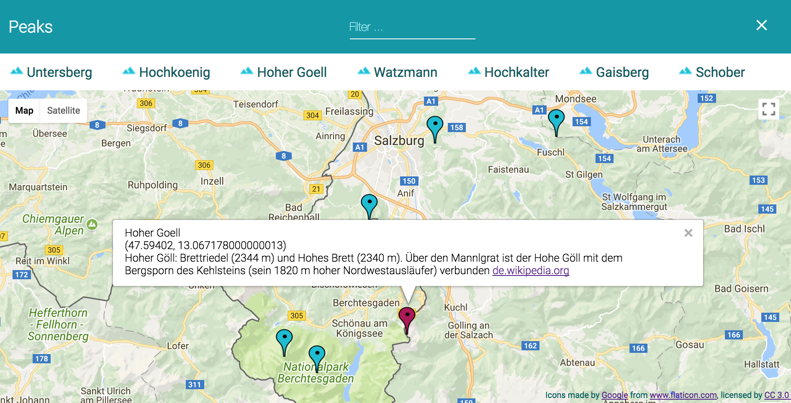

# Udacity: Neighborhood Map Project
===============================

Single page application featuring a map with handpicked markers on it, including functionality such as third-party data integration as well as various ways of browsing content. Project developed as part of Udacity's Front-End Web Developer Nanodegree.

## Instructions

- Simply run index.html and you'll be presented a bunch of nice peaks to climb (NOTE: mountaineering equipment and experience needed!) in Salzburg/Austria and Bavaria/Germany
- On click, additional information will be shown in an infowindow (pulled from Wikipedia if available)
- Filter peaks using the input field provided

## File Structure

- index.html: main html including knockout declarative bindings
- main.css: all css
- model.js: base data, i.e. the array of locations/peaks
- initmap.js: initialises the Google map
- viewmodel.js: all core functionality

## APIs, Frameworks, Libraries

- knockout.js: automatic UI refresh including filter implementation
- maps.googleapis.com: Google maps
- fonts.googleapis.com: Roboto Roboto
- jquery: AJAX. Could easily replaced with a vanilla XHR to save some KBs
- de.wikipedia.org/w/api.php: additional location info

## Feedback

Always welcome!
